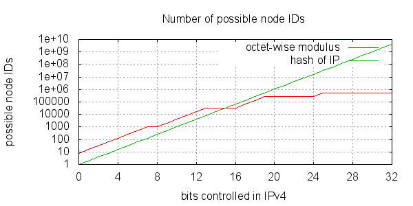
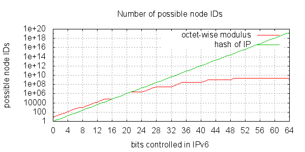

=================================
BitTorrent DHT security extension
=================================

:Author: Arvid Norberg, arvid@rasterbar.com
:Version: 0.16.13

.. contents:: Table of contents
  :depth: 2
  :backlinks: none

BitTorrent DHT security extension
---------------------------------

The purpose of this extension is to make it harder to launch a few
specific attacks against the BitTorrent DHT and also to make it harder
to snoop the network.

Specifically the attack this extension intends to make harder is launching
8 or more DHT nodes which node-IDs selected close to a specific target
info-hash, in order to become the main nodes hosting peers for it. Currently
this is very easy to do and lets the attacker not only see all the traffic
related to this specific info-hash but also block access to it by other
peers.

The proposed guard against this is to enforce restrictions on which node-ID
a node can choose, based on its external IP address.

considerations
--------------

One straight forward scheme to tie the node ID to an IP would be to hash
the IP and force the node ID to share the prefix of that hash. One main
draw back of this approach is that an entities control over the DHT key
space grows linearly with its control over the IP address space.

In order to successfully launch an attack, you just need to find 8 IPs
whose hash will be *closest* to the target info-hash. Given the current
size of the DHT, that is quite likely to be possible by anyone in control
of a /8 IP block.

The size of the DHT is approximately 8.4 million nodes. This is estmiated
by observing that a typical routing table typically has about 20 of its
top routing table buckets full. That means the key space is dense enough
to contain 8 nodes for every combination of the 20 top bits of node IDs.

	``2^20 * 8 = 8388608``

By controlling that many IP addresses, an attacker could snoop any info-hash.
By controlling 8 times that many IP addresses, an attacker could actually
take over any info-hash.

With IPv4, snooping would require a /8 IP block, giving access to 16.7 million
Ips.

Another problem with hashing the IP is that multiple users behind a NAT are
forced to run their DHT nodes on the same node ID.

Node ID restriction
-------------------

In order to avoid the number node IDs controlled to grow linearly by the number
of IPs, as well as allowing more than one node ID per external IP, the node
ID can be restricted at each class level of the IP.

Another important property of the restriction put on node IDs is that the
distribution of the IDs remoain uniform. This is why CRC32 was chosen
as the hash function. See `comparisons of hash functions`__.

__ http://blog.libtorrent.org/2012/12/dht-security/

The expression to calculate a valid ID prefix (from an IPv4 address) is::

	crc32((ip & 0x01071f7f) .. r)

And for an IPv6 address (``ip`` is the high 64 bits of the address)::

	crc32((ip & 0x000103070f1f3f7f) ..  r)

``r`` is a random number in the range [0, 7]. The resulting integer,
representing the masked IP address is supposed to be big-endian before
hashed. The ".." means concatenation.

The details of implementing this is to evaluate the expression, store the
result in a big endian 64 bit integer and hash those 8 bytes with CRC32.

The first 4 bytes of the node ID used in the DHT MUST match the first 4
bytes in the resulting hash. The last byte of the hash MUST match the
random number (``r``) used to generate the hash.

Example code code for calculating a valid node ID::

	uint8_t* ip; // our external IPv4 or IPv6 address (network byte order)
	int num_octets; // the number of octets to consider in ip (4 or 8)
	uint8_t node_id[20]; // resulting node ID

	uint8_t v4mask[] = { 0x01, 0x07, 0x1f, 0x7f };
	uint8_t v6mask[] = { 0x00, 0x01, 0x03, 0x07, 0x0f, 0x1f, 0x3f, 0x7f };
	uint8_t* mask = num_octets == 4 ? v4_mask : v8_mask;

	for (int i = 0; i < num_octets; ++i)
		ip[i] &= mask[i];

	uint32_t rand = rand() & 0xff;
	uint8_t r = rand & 0x7;

	uint32_t crc = crc32(0, NULL, 0);
	crc = crc32(crc, ip, num_octets);
	crc = crc32(crc, &r, 1);

	node_id[0] = (crc >> 24) & 0xff;
	node_id[1] = (crc >> 16) & 0xff;
	node_id[2] = (crc >> 8) & 0xff;
	node_id[3] = crc & 0xff;
	for (int i = 4; i < 19; ++i) node_id[i] = std::rand();
	node_id[19] = rand;

test vectors:

.. parsed-literal::

	IP           rand  example node ID
	============ ===== ==========================================
	124.31.75.21   1   **1712f6c7** 0c5d6a4ec8a88e4c6ab4c28b95eee4 **01**
	21.75.31.124  86   **946406c1** 4e7a08645677bbd1cfe7d8f956d532 **56**
	65.23.51.170  22   **fefd9220** bc8f112a3d426c84764f8c2a1150e6 **16**
	84.124.73.14  65   **af1546dd** 1bb1fe518101ceef99462b947a01ff **41**
	43.213.53.83  90   **a9e920bf** 5b7c4be0237986d5243b87aa6d5130 **5a**

The bold parts of the node ID are the important parts. The rest are
random numbers.

bootstrapping
-------------

In order to set ones initial node ID, the external IP needs to be known. This
is not a trivial problem. With this extension, *all* DHT responses SHOULD include
a *top-level* field called ``ip``, containing a compact binary representation of
the requestor's IP and port. That is big endian IP followed by 2 bytes of big endian
port.

The IP portion is the same byte sequence used to verify the node ID.

It is important that the ``ip`` field is in the top level dictionary. Nodes that
enforce the node-ID will respond with an error message ("y": "e", "e": { ... }),
whereas a node that supports this extension but without enforcing it will respond
with a normal reply ("y": "r", "r": { ... }).

A DHT node which receives an ``ip`` result in a request SHOULD consider restarting
its DHT node with a new node ID, taking this IP into account. Since a single node
can not be trusted, there should be some mechanism to determine whether or
not the node has a correct understanding of its external IP or not. This could
be done by voting, or only restart the DHT once at least a certain number of
nodes, from separate searches, tells you your node ID is incorrect.

enforcement
-----------

Once enforced, write tokens from peers whose node ID does not match its external
IP should be considered dropped. In other words, a peer that uses a non-matching
ID MUST never be used to store information on, regardless of which request. In the
original DHT specification only ``announce_peer`` stores data in the network,
but any future extension which stores data in the network SHOULD use the same
restriction.

Any peer on a local network address is exempt from this node ID verification.
This includes the following IP blocks:

10.0.0.0/8
	reserved for local networks
172.16.0.0/12
	reserved for local networks
192.168.0.0/16
	reserved for local networks
169.254.0.0/16
	reserved for self-assigned IPs
127.0.0.0/8
	reserved for loopback

backwards compatibility and transition
--------------------------------------

During some transition period, this restriction should not be enforced, and
peers whose node ID does not match this formula relative to their external IP
should not be blocked.

Requests from peers whose node ID does not match their external IP should
always be serviced, even after the transition period. The attack this protects
from is storing data on an attacker's node, not servicing an attackers request.

forward compatibility
---------------------

If the total size of the DHT grows to the point where the inherent size limit
in this proposal is too small, the modulus constants can be updated in a new
proposal, and another transition period where both sets of modulus constants
are accepted.

