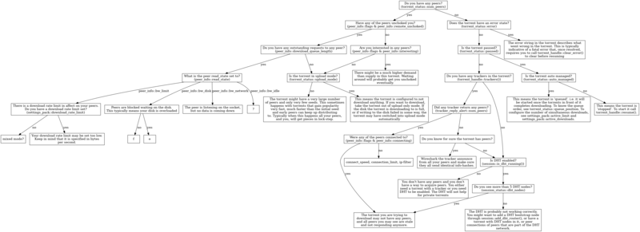

=================
libtorrent manual
=================

:Author: Arvid Norberg, arvid@libtorrent.org
:Version: 1.0.8

.. contents:: Table of contents
  :depth: 2
  :backlinks: none

The following troubleshooting chart may help in finding out why torrents fail
to download. It is not complete, please submit suggestions via mail to
arvid@libtorrent.org or to the `mailing list`_. Ideally in the form of patches
against ``docs/troubleshooting.dot``.

.. _`mailing list`: http://lists.sourceforge.net/lists/listinfo/libtorrent-discuss

|thumb|__

__ troubleshooting.png

