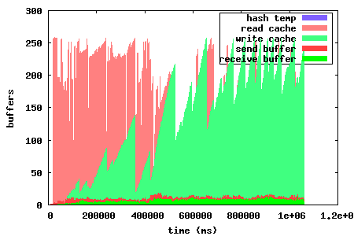
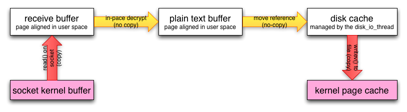
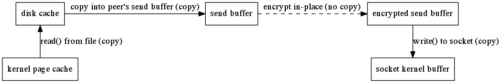
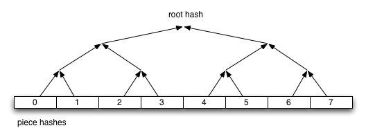
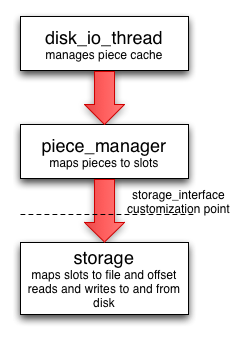

=================
libtorrent manual
=================

:Author: Arvid Norberg, arvid@rasterbar.com
:Version: 0.16.13

.. contents:: Table of contents
  :depth: 2
  :backlinks: none

introduction
============

libtorrent is a feature complete C++ bittorrent implementation focusing
on efficiency and scalability. It runs on embedded devices as well as
desktops. It boasts a well documented library interface that is easy to
use. It comes with a simple bittorrent client demonstrating the use of
the library.

features
========

libtorrent is under active development. It is an ongoing project. Its
current state supports and includes the following features:

extensions
----------

* plugin interface for implementing custom bittorrent extensions
  without having to modify libtorrent
* supports trackerless torrents (using the Mainline kademlia DHT protocol) with
  some `DHT extensions`_. `BEP 5`_.
* supports the bittorrent `extension protocol`_. See extensions_. `BEP 10`_.
* supports the uTorrent metadata transfer protocol `BEP 9`_ (i.e. magnet links).
* supports the uTorrent peer exchange protocol (PEX).
* supports local peer discovery (multicasts for peers on the same local network)
* multitracker extension support (supports both strict `BEP 12`_ and the
  uTorrent interpretation).
* tracker scrapes
* supports lt_trackers extension, to exchange trackers between peers
* `HTTP seeding`_, as specified in `BEP 17`_ and `BEP 19`_.
* supports the udp-tracker protocol. (`BEP 15`_).
* supports the ``no_peer_id=1`` extension that will ease the load off trackers.
* supports the ``compact=1`` tracker parameter.
* super seeding/initial seeding (`BEP 16`_).
* private torrents (`BEP 27`_).
* upload-only extension (`BEP 21`_).
* support for IPv6, including `BEP 7`_ and `BEP 24`_.
* support for merkle hash tree torrents. This makes the size of torrent files
  scale well with the size of the content.
* share-mode. This is a special mode torrents can be put in to optimize share
  ratio rather than downloading the torrent.

.. _article: utp.html
.. _extensions: manual.html#extensions
.. _`http seeding`: manual.html#http-seeding

disk management
---------------

* uses a separate disk I/O thread to not have the disk ever block on network or
  client interaction. (see threads_).
* supports files > 2 gigabytes.
* fast resume support, a way to get rid of the costly piece check at the
  start of a resumed torrent. Saves the storage state, piece_picker state
  as well as all local peers in a separate fast-resume file.
* has an adjustable read and write disk cache for improved disk throughput.
* queues torrents for file check, instead of checking all of them in parallel.
* does not have any requirements on the piece order in a torrent that it
  resumes. This means it can resume a torrent downloaded by any client.
* seed mode, where the files on disk are assumed to be complete, and each
  piece's hash is verified the first time it is requested.

.. _threads: manual.html#threads

network
-------

* a high quality uTP implementation (`BEP 29`_). A transport protocol with
  delay based congestion control. See separate article_.
* adjusts the length of the request queue depending on download rate.
* serves multiple torrents on a single port and in a single thread
* piece picking on block-level (as opposed to piece-level).
  This means it can download parts of the same piece from different peers.
  It will also prefer to download whole pieces from single peers if the
  download speed is high enough from that particular peer.
* supports http proxies and basic proxy authentication
* supports gzipped tracker-responses
* can limit the upload and download bandwidth usage and the maximum number of
  unchoked peers
* possibility to limit the number of connections.
* delays have messages if there's no other outgoing traffic to the peer, and
  doesn't send have messages to peers that already has the piece. This saves
  bandwidth.
* selective downloading. The ability to select which parts of a torrent you
  want to download.
* ip filter to disallow ip addresses and ip ranges from connecting and
  being connected.
* NAT-PMP and UPnP support (automatic port mapping on routers that supports it)
* implements automatic upload slots, to optimize download rate without spreading
  upload capacity too thin. The number of upload slots is adjusted based on the
  peers' download capacity to work even for connections that are orders of
  magnitude faster than others.

.. _`DHT extensions`: dht_extensions.html
.. _`BEP 5`: http://bittorrent.org/beps/bep_0005.html
.. _`BEP 7`: http://bittorrent.org/beps/bep_0007.html
.. _`BEP 9`: http://bittorrent.org/beps/bep_0009.html
.. _`BEP 10`: http://bittorrent.org/beps/bep_0010.html
.. _`BEP 12`: http://bittorrent.org/beps/bep_0012.html
.. _`BEP 15`: http://bittorrent.org/beps/bep_0015.html
.. _`BEP 16`: http://bittorrent.org/beps/bep_0016.html
.. _`BEP 17`: http://bittorrent.org/beps/bep_0017.html
.. _`BEP 19`: http://bittorrent.org/beps/bep_0019.html
.. _`BEP 21`: http://bittorrent.org/beps/bep_0021.html
.. _`BEP 24`: http://bittorrent.org/beps/bep_0024.html
.. _`BEP 27`: http://bittorrent.org/beps/bep_0027.html
.. _`BEP 29`: http://bittorrent.org/beps/bep_0029.html
.. _`extension protocol`: extension_protocol.html

highlighted features
====================

disk caching
------------

All disk I/O in libtorrent is done asynchronously to the network thread, by the
disk io thread. When a block is read, the disk io thread reads all subsequent
blocks from that piece into the read cache, assuming that the peer requesting
the block will also request more blocks from the same piece. This decreases the
number of syscalls for reading data. It also decreases delay from seeking.

Similarly, for write requests, blocks are cached and flushed to disk once one full
piece is complete or the piece is the least recently updated one when more cache
space is needed. The cache dynamically allocates space between the write and read
cache. The write cache is strictly prioritized over the read cache.

The cache blocks that are in used, are locked into physical memory to avoid it
being paged out to disk. Allowing the disk cache to be paged out to disk means
that it would become extremely inefficient to flush it, since it would have to be
read back into physical memory only to be flushed back out to disk again.

In order to conserve memory, and system calls, iovec file operations are
used to flush multiple cache blocks in a single call.

On low-memory systems, the disk cache can be disabled altogether or set to smaller
limit, to save memory.

The disk caching algorithm is configurable between 'LRU' and 'largest contiguous'.
The largest contiguous algorithm is the default and flushes the largest contiguous
block of buffers, instead of flushing all blocks belonging to the piece which was
written to least recently.

For version 0.15 a lot of work went into optimizing the cache algorithm, trying
to increase the cache hit rate and utilization. The graph to the left shows the
memory utilization in 0.14. This cache is a straight forward, fairly naive, implementation.
Every block read will also read all subsequent blocks in that piece into the cache.
Whenever we need more space, the entire oldest piece is evicted from the cache. Caching
writes always takes presedence over the read cache. Whenever a piece is fully downloaded,
it is flushed to disk.

.. image:: disk_buffer.png
	:width: 49%

The left graph shows the problem of evicting entire pieces at a time, and waiting until
an entire piece is downloaded until flushing it. These graphs were generated for a torrent
with fairly large pieces. This means that granularity was poor in 0.14, since it only
dealt with entire pieces. In 0.15, the granularity problem has been fixed by evicting one
block at a time from the read cache. This maximizes the read cache utilization. The write
cache is also flushed when a sufficient number of contiguous blocks have been downloaded
for a piece, which is not tied to the piece size anymore. This way the cache scales a lot
better with piece sizes.

The graph to the right shows the same download but with the new optimized disk cache
algorithm. It clearly shows an increased utilization, which means higher read hit rates
or smaller caches with maintained hit rate.

high performance disk subsystem
-------------------------------

In some circumstances, the disk cache may not suffice to provide maximum performance.
One such example is high performance seeding, to a large number of peers, over a fast
up-link. In such a case, the amount of RAM may simply not be enough to cache disk
reads. When there's not enough RAM to cache disk reads, the disk throughput  would
typically degrade to perform as poorly as with no cache at all, with the majority
of the time spent waiting for the disk head to seek.

To solve this problem, libtorrent sorts read requests by their physical offset on the
disk. They are processed by having the disk read head sweep back and forth over the drive.

This makes libtorrent very suitable for large scale, high-throughput seeding.

.. image:: disk_access_no_elevator.png
	:width: 49%

.. image:: disk_access_elevator.png
	:width: 49%

These plots illustrates the physical disk offset for reads over time. The left plot
is of a run where disk operation re-ordering is turned off and the righ is when it's
turned on. The right one has a relatively smooth sine wave shape whereas the left
one is more random and involves much longer seeks back and forth over the disk.

True physical disk offset queries are only supported on newer linux kernels, Mac OS X and
Windows 2000 and up.

network buffers
---------------

On CPUs with small L2 caches, copying memory can be expensive operations. It is important
to keep copying to a minimum on such machines. This mostly applies to embedded systems.

In order to minimize the number of times received data is copied, the receive buffer
for payload data is received directly into a page aligned disk buffer. If the connection
is encrypted, the buffer is decrypted in-place. The buffer is then moved into the disk
cache without being copied. Once all the blocks for a piece have been received, or the
cache needs to be flushed, all the blocks are passed directly to ``writev()`` to flush
them in a single syscall. This means a single copy into user space memory, and a single
copy back into kernel memory, as illustrated by this figure:

When seeding and uploading in general, unnecessary copying is avoided by caching blocks
in aligned buffers, that are copied once into the peer's send buffer. The peer's send buffer
is not guaranteed to be aligned, even though it is most of the time. The send buffer is
then encrypted with the peer specific key and chained onto the ``iovec`` for sending.
This means there is one user space copy in order to allow unaligned peer requests and
peer-specific encryption. This is illustrated by the following figure:

piece picker
------------

The piece picker is a central component in a bittorrent implementation. The piece picker
in libtorrent is optimized for quickly finding the rarest pieces. It keeps a list of all
available pieces sorted by rarity, and pieces with the same rarity, shuffled. The rarest
first mode is the dominant piece picker mode. Other modes are supported as well, and
used by peers in specific situations.

The piece picker allows to combine the availability of a piece with a priority. Together
they determine the sort order of the piece list. Pieces with priority 0 will never be
picked, which is used for the selective download feature.

In order to have as few partially finished pieces as possible, peers have an affinity
towards picking blocks from the same pieces as other peers in the same speed category.
The speed category is a coarse categorization of peers based on their download rate. This
makes slow peers pick blocks from the same piece, and fast peers pick from the same piece,
and hence decreasing the likelihood of slow peers blocking the completion of pieces.

The piece picker can also be set to download pieces in sequential order.

share mode
----------

The share mode feature in libtorrent is intended for users who are only interested in
helping out swarms, not downloading the torrents.

It works by predicting the demand for pieces, and only download pieces if there is enough
demand. New pieces will only be downloaded once the share ratio has hit a certain target.

This feature is especially useful when combined with RSS, so that a client can be set up
to provide additional bandwidth to an entire feed.

merkle hash tree torrents
-------------------------

Merkle hash tree torrents is an extension that lets a torrent file only contain the
root hash of the hash tree forming the piece hashes. The main benefit of this feature
is that regardless of how many pieces there is in a torrent, the .torrent file will
always be the same size. It will only grow with the number of files (since it still
has to contain the file names).

With regular torrents, clients have to request multiple blocks for pieces, typically
from different peers, before the data can be verified against the piece hash. The
larger the pieces are, the longer it will take to download a complete piece and verify
it. Before the piece is verified, it cannot be shared with the swarm, which means the
larger piece sizes, the slower turnaround data has when it is downloaded by peers.
Since on average the data has to sit around, waiting, in client buffers before it has
been verified and can be uploaded again.

Another problem with large piece sizes is that it is harder for a client to pinpoint
the malicious or buggy peer when a piece fails, and it will take longer to re-download
it and take more tries before the piece succeeds the larger the pieces are.

The piece size in regular torrents is a tradeoff between the size of the .torrent file
itself and the piece size. Often, for files that are 4 GB, the piece size is 2 or 4 MB,
just to avoid making the .torrent file too big.

Merkle torrents solves these problems by removing the tradeoff between .torrent size and
piece size. With merkle torrents, the piece size can be the minimum block size (16 kB),
which lets peers verify every block of data received from peers, immediately. This
gives a minimum turnaround time and completely removes the problem of identifying malicious
peers.

The root hash is built by hashing all the piece hashes pair-wise, until they all collapse
down to the root.

customizable file storage
-------------------------

libtorrent's storage implementation is customizable. That means a special purpose bittorrent
client can replace the default way to store files on disk.

When implementing a bittorrent cache, it doesn't matter how the data is stored on disk, as
long as it can be retrieved and seeded. In that case a new storage class can be implemented
(inheriting from the ``storage_interface`` class) that avoids the unnecessary step of mapping
slots to files and offsets. The storage can ignore the file boundaries and just store the
entire torrent in a single file (which will end up being all the files concatenated). The main
advantage of this, other than a slight cpu performance gain, is that all file operations would
be page (and sector) aligned. This enables efficient unbuffered I/O, and can potentially
lead to more efficient read caching (using the built in disk cache rather than relying on the
operating system's disk cache).

The storage interface supports operating systems where you can ask for sparse regions
(such as Windows and Solaris). The advantage of this is that when checking files, the regions
that are known to be sparse can be skipped, which can reduce the time to check a torrent
significantly.

easy to use API
---------------

One of the design goals of the libtorrent API is to make common operations simple, but still
have it possible to do complicated and advanced operations. This is best illustrated by example
code to implement a simple bittorrent client::

	#include <iostream>
	#include "libtorrent/session.hpp"

	// usage a.out [torrent-file]
	int main(int argc, char* argv[]) try
	{
		using namespace libtorrent;

		session s;
		s.listen_on(std::make_pair(6881, 6889));
		add_torrent_params p;
		p.save_path = "./";
		p.ti = new torrent_info(argv[1]);
		s.add_torrent(p);

		// wait for the user to end
		char a;
		std::cin.unsetf(std::ios_base::skipws);
		std::cin >> a;
		return 0;
	}
	catch (std::exception& e)
	{
		std::cerr << ec.what() << std::endl;
		return 1;
	}

This client doesn't give the user any status information or progress about the torrent, but
it is fully functional.

libtorrent also comes with python bindings for easy access for python developers.

portability
===========

libtorrent runs on most major operating systems, including Windows,
MacOS X, Linux, BSD and Solaris.
It uses Boost.Thread, Boost.Filesystem, Boost.Date_time and various other
boost libraries as well as zlib_ (shipped) and asio_ (shipped). At least version
1.34.1 of boost is required.

.. _zlib: http://www.zlib.org
.. _asio: http://asio.sf.net

libtorrent uses asio, hence it will take full advantage of high performance
network APIs on the most popular platforms. I/O completion ports on windows,
epoll on linux and kqueue on MacOS X and BSD.

libtorrent has been successfully compiled and tested on:

* Windows 2000, XP and Vista vc7.1, vc8
* Linux x86 GCC 3.3, GCC 3.4.2, 4.x
* Linux PPC GCC 4.1.1
* MacOS X (darwin), (Apple's) GCC 3.3, (Apple's) GCC 4.0
* SunOS 5.8 GCC 3.1 and Sunpro
* Cygwin GCC 3.3.3

Fails on:

* GCC 2.95.4
* msvc6

