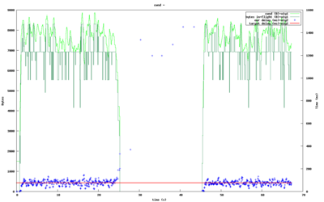
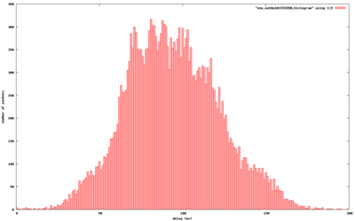
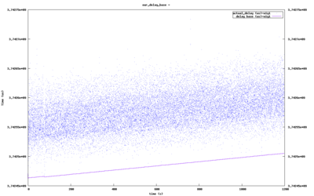

=================
libtorrent manual
=================

:Author: Arvid Norberg, arvid@rasterbar.com
:Version: 0.16.13

.. contents:: Table of contents
  :depth: 2
  :backlinks: none

uTP
===

uTP (uTorrent transport protocol) is a transport protocol which uses one-way
delay measurements for its congestion controller. This article is about uTP
in general and specifically about libtorrent's implementation of it.

rationale
---------

One of the most common problems users are experiencing using bittorrent is
that their internet "stops working". This can be caused by a number of things,
for example:

1.  a home router that crashes or slows down when its NAT pin-hole
    table overflows, triggered by DHT or simply many TCP connections. 

2. a home router that crashes or slows down by UDP traffic (caused by
   the DHT)

3. a home DSL or cable modem having its send buffer filled up by outgoing
   data, and the buffer fits seconds worth of bytes. This adds seconds
   of delay on interactive traffic. For a web site that needs 10 round
   trips to load this may mean 10s of seconds of delay to load compared
   to without bittorrent. Skype or other delay sensitive applications
   would be affected even more.

This document will cover (3).

Typically this is solved by asking the user to enter a number of bytes
that the client is allowed to send per second (i.e. setting an upload
rate limit). The common recommendation is to set this limit to 80% of the
uplink's capacity. This is to leave some headroom for things like TCP
ACKs as well as the user's interactive use of the connection such as
browsing the web or checking email.

There are two major drawbacks with this technique:

1. The user needs to actively make this setting (very few protocols
   require the user to provide this sort of information). This also
   means the user needs to figure out what its up-link capacity is.
   This is unfortunately a number that many ISPs are not advertizing
   (because it's often much lower than the download capacity) which
   might make it hard to find.

2. The 20% headroom is wasted most of the time. Whenever the user
   is not using the internet connection for anything, those extra 20%
   could have been used by bittorrent to upload, but they're already
   allocated for interactive traffic. On top of that, 20% of the up-link
   is often not enough to give a good and responsive browsing experience.

The ideal bandwidth allocation would be to use 100% for bittorrent when
there is no interactive cross traffic, and 100% for interactive traffic
whenever there is any. This would not waste any bandwidth while the user
is idling, and it would make for a much better experience when the user
is using the internet connection for other things.

This is what uTP does.

TCP
---

The reason TCP will fill the send buffer, and cause the delay on all traffic,
is because its congestion control is *only* based on packet loss (and timeout).

Since the modem is buffering, packets won't get dropped until the entire queue
is full, and no more packets will fit. The packets will be dropped, TCP will
detect this within an RTT or so. When TCP notices a packet loss, it will slow
down its send rate and the queue will start to drain again. However, TCP will
immediately start to ramp up its send rate again until the buffer is full and
it detects packet loss again.

TCP is designed to fully utilize the link capacity, without causing congestion.
Whenever it sense congestion (through packet loss) it backs off. TCP is not
designed to keep delays low. When you get the first packet loss (assuming the
kind of queue described above, tail-queue) it is already too late. Your queue
is full and you have the maximum amount of delay your modem can provide.

TCP controls its send rate by limiting the number of bytes in-flight at any
given time. This limit is called congestion window (*cwnd* for short). During
steady state, the congestion window is constantly increasing linearly. Each
packet that is successfully transferred will increase cwnd.

::

	            cwnd
	send_rate = ----
	            RTT
	

Send rate is proportional to cwnd divided by RTT. A smaller cwnd will cause
the send rate to be lower and a larger cwnd will cause the send rate to be
higher.

Using a congestion window instead of controlling the rate directly is simple
because it also introduces an upper bound for memory usage for packets that
haven't been ACKed yet and needs to be kept around.

The behavior of TCP, where it bumps up against the ceiling, backs off and then
starts increasing again until it hits the ceiling again, forms a saw tooth shape.
If the modem wouldn't have any send buffer at all, a single TCP stream would
not be able to fully utilize the link because of this behavior, since it would
only fully utilize the link right before the packet loss and the back-off.

LEDBAT congestion controller
----------------------------

The congestion controller in uTP is called LEDBAT_, which also is an IETF working
group attempting to standardize it. The congestion controller, on top of reacting
to packet loss the same way TCP does, also reacts to changes in delays.

For any uTP (or LEDBAT_) implementation, there is a target delay. This is the
amount of delay that is acceptable, and is in fact targeted for the connection.
The target delay is defined to 25 ms in LEDBAT_, uTorrent uses 100 ms and
libtorrent uses 75 ms. Whenever a delay measurement is lower than the target,
cwnd is increased proportional to (target_delay - delay). Whenever the measurement
is higher than the target, cwnd is decreased proportional to (delay - target_delay).

It can simply be expressed as::

	cwnd += gain * (target_delay - delay)

Similarly to TCP, this is scaled so that the increase is evened out over one RTT.

The linear controller will adjust the cwnd more for delays that are far off the
target, and less for delays that are close to the target. This makes it converge
at the target delay. Although, due to noise there is almost always some amount of
oscillation. This oscillation is typically smaller than the saw tooth TCP forms.

The figure to the right shows how (TCP) cross traffic causese uTP to essentially
entirely stop sending anything. Its delay measurements are mostly well above the target
during this time. The cross traffic is only a single TCP stream in this test.

As soon as the cross traffic ceases, uTP will pick up its original send rate within
a second.

Since uTP constantly measures the delay, with every single packet, the reaction time
to cross traffic causing delays is a single RTT (typically a fraction of a second).

one way delays
--------------

uTP measures the delay imposed on packets being sent to the other end
of the connection. This measurement only includes buffering delay along
the link, not propagation delay (the speed of light times distance) nor
the routing delay (the time routers spend figuring out where to forward
the packet). It does this by always comparing all measurements to a
baseline measurement, to cancel out any fixed delay. By focusing on the
variable delay along a link, it will specifically detect points where
there might be congestion, since those points will have buffers.

Delay on the return link is explicitly not included in the delay measurement.
This is because in a peer-to-peer application, the other end is likely to also
be connected via a modem, with the same send buffer restrictions as we assume
for the sending side. The other end having its send queue full is not an indication
of congestion on the path going the other way.

In order to measure one way delays for packets, we cannot rely on clocks being
synchronized, especially not at the microsecond level. Instead, the actual time
it takes for a packet to arrive at the destination is not measured, only the changes
in the transit time is measured.

Each packet that is sent includes a time stamp of the current time, in microseconds,
of the sending machine. The receiving machine calculates the difference between its
own timestamp and the one in the packet and sends this back in the ACK. This difference,
since it is in microseconds, will essentially be a random 32 bit number. However,
the difference will stay somewhat similar over time. Any changes in this difference
indicates that packets are either going through faster or slower.

In order to measure the one-way buffering delay, a base delay is established. The
base delay is the lowest ever seen value of the time stamp difference. Each delay
sample we receive back, is compared against the base delay and the delay is the
difference.

This is the delay that's fed into the congestion controller.

A histogram of typical delay measurements is shown to the right. This is from
a transfer between a cable modem connection and a DSL connection.

The details of the delay measurements are slightly more complicated since the
values needs to be able to wrap (cross the 2^32 boundry and start over at 0).

Path MTU discovery
------------------

MTU is short for *Maximum Transfer Unit* and describes the largest packet size that
can be sent over a link. Any datagrams which size exceeds this limit will either
be *fragmented* or dropped. A fragmented datagram means that the payload is split up
in multiple packets, each with its own individual packet header.

There are several reasons to avoid sending datagrams that get fragmented:

1. A fragmented datagram is more likely to be lost. If any fragment is lost,
   the whole datagram is dropped.

2. Bandwidth is likely to be wasted. If the datagram size is not divisible
   by the MTU the last packet will not contain as much payload as it could, and the
   payload over protocol header ratio decreases.

3. It's expensive to fragment datagrams. Few routers are optimized to handle large
   numbers of fragmented packets. Datagrams that have to fragment are likely to
   be delayed significantly, and contribute to more CPU being used on routers.
   Typically fragmentation (and other advanced IP features) are implemented in
   software (slow) and not hardware (fast).

The path MTU is the lowest MTU of any link along a path from two endpoints on the
internet. The MTU bottleneck isn't necessarily at one of the endpoints, but can
be anywhere in between.

The most common MTU is 1500 bytes, which is the largest packet size for ethernet
networks. Many home DSL connections, however, tunnel IP through PPPoE (Point to
Point Protocol over Ethernet. Yes, that is the old dial-up modem protocol). This
protocol uses up 8 bytes per packet for its own header.

If the user happens to be on an internet connection over a VPN, it will add another
layer, with its own packet headers.

In short; if you would pick the largest possible packet size on an ethernet network,
1472, and stick with it, you would be quite likely to generate fragments for a lot
of connections. The fragments that will be created will be very small and especially
inflate the overhead waste.

The other approach of picking a very conservative packet size, that would be very
unlikely to get fragmented has the following drawbacks:

1. People on good, normal, networks will be penalized with a small packet size.
   Both in terms of router load but also bandwidth waste.

2. Software routers are typically not limited by the number of bytes they can route,
   but the number of packets. Small packets means more of them, and more load on
   software routers.

The solution to the problem of finding the optimal packet size, is to dynamically
adjust the packet size and search for the largest size that can make it through
without being fragmented along the path.

To help do this, you can set the DF bit (Don't Fragment) in your Datagrams. This
asks routers that otherwise would fragment packets to instead drop them, and send
back an ICMP message reporting the MTU of the link the packet couldn't fit. With
this message, it's very simple to discover the path MTU. You simply mark your packets
not to be fragmented, and change your packet size whenever you receive the ICMP
packet-too-big message.

Unfortunately it's not quite that simple. There are a significant number of firewalls
in the wild blocking all ICMP messages. This means we can't rely on them, we also have
to guess that a packet was dropped because of its size. This is done by only marking
certain packets with DF, and if all other packets go through, except for the MTU probes,
we know that we need to lower our packet sizes.

If we set up bounds for the path MTU (say the minimum internet MTU, 576 and ethernet's 1500),
we can do a binary search for the MTU. This would let us find it in just a few round-trips.

On top of this, libtorrent has an optimization where it figures out which interface a
uTP connection will be sent over, and initialize the MTU ceiling to that interface's MTU.
This means that a VPN tunnel would advertize its MTU as lower, and the uTP connection would
immediately know to send smaller packets, no search required. It also has the side-effect
of being able to use much larger packet sizes for non-ethernet interfaces or ethernet links
with jumbo frames.

clock drift
-----------

Clock drift is clocks progressing at different rates. It's different from clock
skew which means clocks set to different values (but which may progress at the same
rate).

Any clock drift between the two machines involved in a uTP transfer will result
in systematically inflated or deflated delay measurements.

This can be solved by letting the base delay be the lowest seen sample in the last
*n* minutes. This is a trade-off between seeing a single packet go straight through
the queue, with no delay, and the amount of clock drift one can assume on normal computers.

It turns out that it's fairly safe to assume that one of your packets will in fact go
straight through without any significant delay, once every 20 minutes or so. However,
the clock drift between normal computers can be as much as 17 ms in 10 minutes. 17 ms
is quite significant, especially if your target delay is 25 ms (as in the LEDBAT_ spec).

Clocks progresses at different rates depending on temperature. This means computers
running hot are likely to have a clock drift compared to computers running cool.

So, by updating the delay base periodically based on the lowest seen sample, you'll either
end up changing it upwards (artificaially making the delay samples appear small) without
the congestion or delay actually having changed, or you'll end up with a significant clock
drift and have artificially low samples because of that.

The solution to this problem is based on the fact that the clock drift is only a problem
for one of the sides of the connection. Only when your delay measurements keep increasing
is it a problem. If your delay measurements keep decreasing, the samples will simply push
down the delay base along with it. With this in mind, we can simply keep track of the
other end's delay measurements as well, applying the same logic to it. Whenever the
other end's base delay is adjusted downwards, we adjust our base delay upwards by the same
amount.

This will accurately keep the base delay updated with the clock drift and improve
the delay measurements. The figure on the right shows the absolute timestamp differences
along with the base delay. The slope of the measurements is caused by clock drift.

For more information on the clock drift compensation, see the slides from BitTorrent's
presentation at IPTPS10_.

.. _IPTPS10: http://www.usenix.org/event/iptps10/tech/slides/cohen.pdf
.. _LEDBAT: https://datatracker.ietf.org/doc/draft-ietf-ledbat-congestion/

features
--------

libtorrent's uTP implementation includes the following features:

* Path MTU discovery, including jumbo frames and detecting restricted
  MTU tunnels. Binary search packet sizes to find the largest non-fragmented.
* Selective ACK. The ability to acknowledge individual packets in the
  event of packet loss
* Fast resend. The first time a packet is lost, it's resent immediately.
  Triggered by duplicate ACKs.
* Nagle's algorithm. Minimize protocol overhead by attempting to lump
  full packets of payload together before sending a packet.
* Delayed ACKs to minimize protocol overhead.
* Microsecond resolution timestamps.
* Advertised receive window, to support download rate limiting.
* Correct handling of wrapping sequence numbers.
* Easy configuration of target-delay, gain-factor, timeouts, delayed-ack
  and socket buffers.

