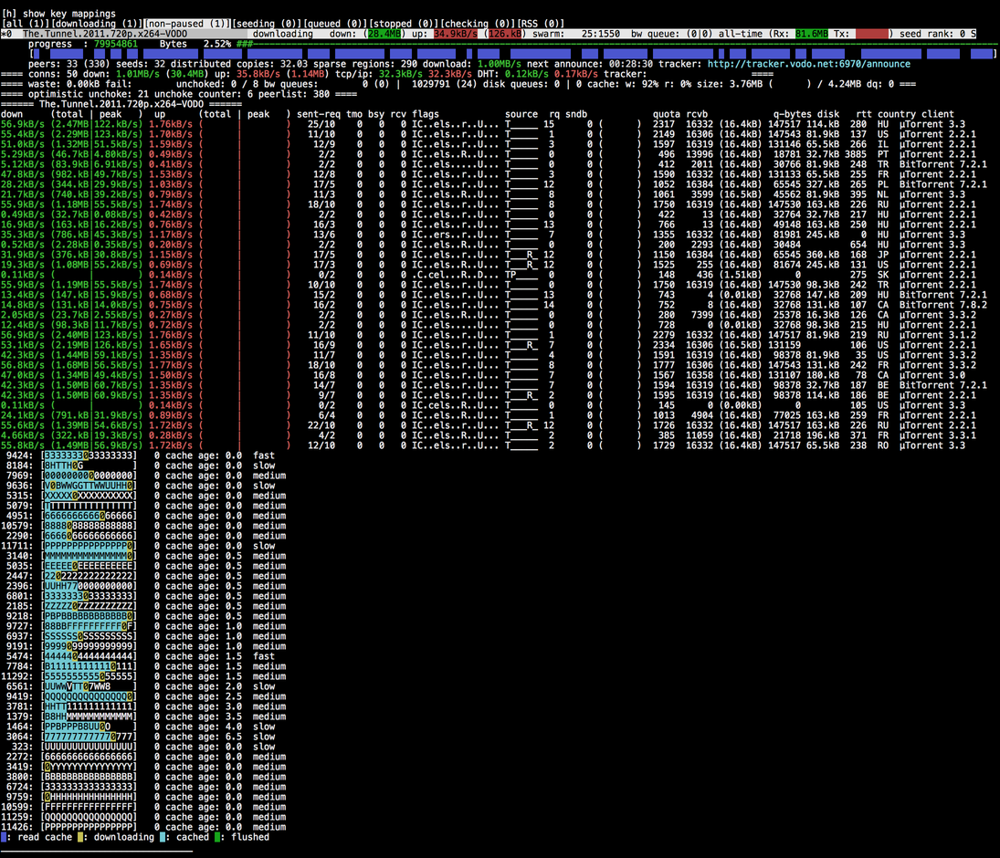

===========================
client_test example program
===========================

Client test is a, more or less, complete bittorrent client. It lacks most
settings and you can't start or stop torrents once you've started it. All
the settings are hardcoded. The commandline arguments are::

  client_test <filename1.torrent> <filename2.torrent> ...

You can start any number of torrent downloads/seeds via the commandline.
If one argument starts with ``http://`` it is interpreted as a tracker
announce url, and it expects an info-hash as the next argument. The info-hash
has to be hex-encoded. For example: ``2410d4554d5ed856d69f426c38791673c59f4418``.
If you pass an announce url and info-hash, a torrent-less download is started.
It relies on that at least one peer on the tracker is running a libtorrent based
client and has the metadata (.torrent file). The metadata extension in
libtorrent will then download it from that peer (or from those peers if more
than one).

While running, the ``client_test`` sample will look something like this:

The commands available in the client are:

* ``q`` quits the client (there will be a delay while the client waits
  for tracker responses)
* ``l`` toggle log. Will display the log at the bottom, informing about
  tracker and peer events.
* ``i`` toggles torrent info. Will show the peer list for each torrent.
* ``d`` toggle download info. Will show the block list for each torrent,
  showing downloaded and requested blocks.
* ``p`` pause all torrents.
* ``u`` unpause all torrents.
* ``r`` force tracker reannounce for all torrents.
* ``f`` toggle show file progress. Displays a list of all files and the
  download progress for each file.

The list at the bottom (shown if you press ``d``) shows which blocks has
been requested from which peer. The green background means that it has been
downloaded. It shows that fast peers will prefer to request whole pieces
instead of dowloading parts of pieces. It may make it easier to determine
which peer that sent the corrupt data if a piece fails the hash test.

