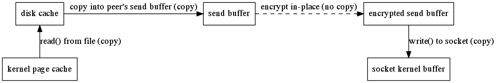

=================
libtorrent manual
=================

:Author: Arvid Norberg, arvid@rasterbar.com
:Version: 0.15.0

.. contents:: Table of contents
  :depth: 2
  :backlinks: none

introduction
============

libtorrent is a feature complete C++ bittorrent implementation focusing
on efficiency and scalability. It runs on embedded devices as well as
desktops. It boasts a well documented library interface that is easy to
use. It comes with a simple bittorrent client demonstrating the use of
the library.

features
========

libtorrent is under active development. It is an ongoing project. Its
current state supports and includes the following features:

extensions
----------

* plugin interface for implementing custom bittorrent extensions
  without having to modify libtorrent
* supports trackerless torrents (using the Mainline kademlia DHT protocol) with
  some `DHT extensions`_. `BEP 5`_.
* supports the bittorrent `extension protocol`_. See extensions_. `BEP 10`_.
* supports the uTorrent metadata transfer protocol (i.e. magnet links).
* supports the uTorrent peer exchange protocol (PEX).
* supports local peer discovery (multicasts for peers on the same local network)
* multitracker extension support (supports both strict `BEP  12`_ and the
  uTorrent interpretation).
* tracker scrapes
* supports lt_trackers extension, to exchange trackers between peers
* `HTTP seeding`_, as specified in `BEP 17`_ and `BEP 19`_.
* supports the udp-tracker protocol. (`BEP 15`_).
* supports the ``no_peer_id=1`` extension that will ease the load off trackers.
* supports the ``compact=1`` tracker parameter.
* super seeding/initial seeding (`BEP 16`_).
* private torrents (`BEP 27`_).
* support for IPv6, including `BEP 7`_ and `BEP 24`_.

.. _extensions: manual.html#extensions
.. _`http seeding`: manual.html#http-seeding

disk management
---------------

* uses a separate disk I/O thread to not have the disk ever block on network or
  client interaction. (see threads_).
* supports files > 2 gigabytes.
* fast resume support, a way to get rid of the costly piece check at the
  start of a resumed torrent. Saves the storage state, piece_picker state
  as well as all local peers in a separate fast-resume file.
* has an adjustable read and write disk cache for improved disk throughput.
* queues torrents for file check, instead of checking all of them in parallel.
* does not have any requirements on the piece order in a torrent that it
  resumes. This means it can resume a torrent downloaded by any client.
* supports both sparse files and compact file allocation (where pieces
  are kept consolidated on disk)
* seed mode, where the files on disk are assumed to be complete, and each
  piece's hash is verified the first time it is requested.

.. _threads: manual.html#threads

network
-------

* adjusts the length of the request queue depending on download rate.
* serves multiple torrents on a single port and in a single thread
* piece picking on block-level (as opposed to piece-level).
  This means it can download parts of the same piece from different peers.
  It will also prefer to download whole pieces from single peers if the
  download speed is high enough from that particular peer.
* supports http proxies and basic proxy authentication
* supports gzipped tracker-responses
* can limit the upload and download bandwidth usage and the maximum number of
  unchoked peers
* implements fair trade. User settable trade-ratio, must at least be 1:1,
  but one can choose to trade 1 for 2 or any other ratio that isn't unfair
  to the other party.
* possibility to limit the number of connections.
* delays have messages if there's no other outgoing traffic to the peer, and
  doesn't send have messages to peers that already has the piece. This saves
  bandwidth.
* selective downloading. The ability to select which parts of a torrent you
  want to download.
* ip filter to disallow ip addresses and ip ranges from connecting and
  being connected
* NAT-PMP and UPnP support (automatic port mapping on routers that supports it)

.. _`DHT extensions`: dht_extensions.html
.. _`BEP 5`: http://bittorrent.org/beps/bep_0005.html
.. _`BEP 7`: http://bittorrent.org/beps/bep_0007.html
.. _`BEP 10`: http://bittorrent.org/beps/bep_0010.html
.. _`BEP 12`: http://bittorrent.org/beps/bep_0012.html
.. _`BEP 15`: http://bittorrent.org/beps/bep_0015.html
.. _`BEP 16`: http://bittorrent.org/beps/bep_0016.html
.. _`BEP 17`: http://bittorrent.org/beps/bep_0017.html
.. _`BEP 19`: http://bittorrent.org/beps/bep_0019.html
.. _`BEP 24`: http://bittorrent.org/beps/bep_0024.html
.. _`BEP 27`: http://bittorrent.org/beps/bep_0027.html
.. _`extension protocol`: extension_protocol.html

highlighted features
====================

disk caching
------------

All disk I/O in libtorrent is done asynchronously to the network thread, by the
disk io thread. When a block is read, the disk io thread reads all subsequent
blocks from that piece into the read cache, assuming that the peer requesting
the block will also request more blocks from the same piece. This decreases the
number of syscalls for reading data. It also decreases delay from seeking.

Similarly, for write requests, blocks are cached and flushed to disk once one full
piece is complete or the piece is the least recently updated one when more cache
space is needed. The cache dynamically allocates space between the write and read
cache. The write cache is strictly prioritized over the read cache.

The cache blocks that are in used, are locked into physical memory to avoid it
being paged out to disk. Allowing the disk cache to be paged out to disk means
that it would become extremely inefficient to flush it, since it would have to be
read back into physical memory only to be flushed back out to disk again.

In order to conserve memory, and system calls, iovec file operations are
used to flush multiple cache blocks in a single call.

On low-memory systems, the disk cache can be disabled altogether or set to smaller
limit, to save memory.

network buffers
---------------

On CPUs with small L2 caches, copying memory can be expensive operations. It is important
to keep copying to a minimum on such machines. This mostly applies to embedded systems.

In order to minimize the number of times received data is copied, the receive buffer
for payload data is received directly into a page aligned disk buffer. If the connection
is encrypted, the buffer is decrypted in-place. The buffer is then moved into the disk
cache without being copied. Once all the blocks for a piece have been received, or the
cache needs to be flushed, all the blocks are passed directly to ``writev()`` to flush
them in a single syscall. This means a single copy into user space memory, and a single
copy back into kernel memory, as illustrated by this figure:

.. image:: write_disk_buffers.png
	:width: 100%

When seeding and uploading in general, unnecessary copying is avoided by caching blocks
in aligned buffers, that are copied once into the peer's send buffer. The peer's send buffer
is not guaranteed to be aligned, even though it is most of the time. The send buffer is
then encrypted with the peer specific key and chained onto the ``iovec`` for sending.
This means there is one user space copy in order to allow unaligned peer requests and
peer-specific encryption. This is illustrated by the following figure:

piece picker
------------

The piece picker is a central component in a bittorrent implementation. The piece picker
in libtorrent is optimized for quickly finding the rarest pieces. It keeps a list of all
available pieces sorted by rarity, and pieces with the same rarity, shuffled. The rarest
first mode is the dominant piece picker mode. Other modes are supported as well, and
used by peers in specific situations.

The piece picker allows to combine the availability of a piece with a priority. Together
they determine the sort order of the piece list. Pieces with priority 0 will never be
picked, which is used for the selective download feature.

In order to have as few partially finished pieces as possible, peers have an affinity
towards picking blocks from the same pieces as other peers in the same speed category.
The speed category is a coarse categorization of peers based on their download rate. This
makes slow peers pick blocks from the same piece, and fast peers pick from the same piece,
and hence decreasing the likelihood of slow peers blocking the completion of pieces.

The piece picker can also be set to download pieces in sequential order.

portability
===========

libtorrent runs on most major operating systems, including Windows,
MacOS X, Linux, BSD and Solaris.
It uses Boost.Thread, Boost.Filesystem, Boost.Date_time and various other
boost libraries as well as zlib_ (shipped) and asio_ (shipped). At least version
1.34.1 of boost is required.

.. _zlib: http://www.zlib.org
.. _asio: http://asio.sf.net

libtorrent uses asio, hence it will take full advantage of high performance
network APIs on the most popular platforms. I/O completion ports on windows,
epoll on linux and kqueue on MacOS X and BSD.

libtorrent has been successfully compiled and tested on:

* Windows 2000, XP and Vista vc7.1, vc8
* Linux x86 GCC 3.3, GCC 3.4.2, 4.x
* Linux PPC GCC 4.1.1
* MacOS X (darwin), (Apple's) GCC 3.3, (Apple's) GCC 4.0
* SunOS 5.8 GCC 3.1 and Sunpro
* Cygwin GCC 3.3.3

Fails on:

* GCC 2.95.4
* msvc6

